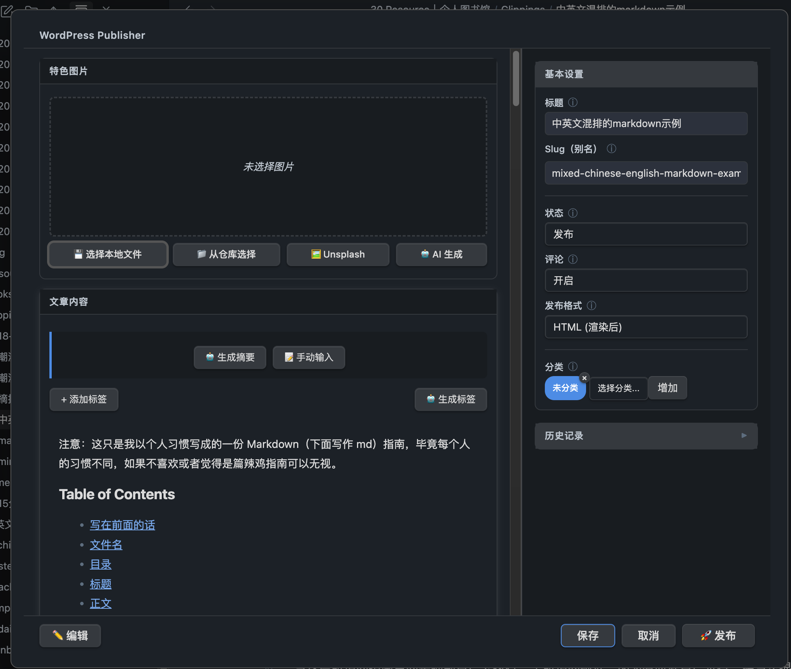

# WordPress Publisher - Obsidian WordPress 发布插件

[English](README.md) | [简体中文](README_zh.md)

**版本**: 2.1.2
**作者**: uu0
**更新日期**: 2026-04-08

## 项目说明

本项目基于 [obsidian-wordpress](https://github.com/devbean/obsidian-wordpress) 进行深度重构和功能扩展。在保留原有 WordPress 发布核心功能的基础上，新增了发布界面、智能 Slug 生成、特色图片选择、AI 服务集成等功能模块，并重构了整体代码架构。

**主要扩展功能**：
- V3 双栏发布界面，移动端自适应单列布局
- 全新的可视化发布界面，支持文章/页面类型选择、分类管理、状态控制
- 智能 Slug 生成系统（拼音转换 / AI 翻译双模式）
- 三种特色图片设置方式（本地图片 / Unsplash 搜索 / AI 生成）
- OpenAI / Claude AI 服务集成，支持自动摘要和智能翻译
- 现代化 UI 设计，支持暗色主题

## 简介

WordPress Publisher 是一款功能强大的 Obsidian 插件，让你能够一键将 Markdown 笔记发布到 WordPress 网站。支持文章和页面两种发布类型，内置智能 Slug 生成、特色图片选择和 AI 功能集成，大幅提升内容发布效率。



## 核心功能

### 📝 内容发布

- **双类型支持**：发布为文章 (Post) 或页面 (Page)
- **分类管理**：支持选择 WordPress 分类和标签
- **状态控制**：草稿、待审、发布等多种状态
- **实时预览**：发布前预览所有设置

### 🔗 智能 Slug 生成

- **拼音模式**：中文标题自动转换为拼音（如 "减脂食谱" → "jian-zhi-shi-pu"）
- **AI 翻译模式**：使用 AI 将中文翻译成英文 Slug（如 "减脂食谱" → "weight-loss-recipes"）
- **手动编辑**：支持在发布界面修改自动生成的 Slug

### 🖼️ 特色图片

三种方式设置特色图片：

1. **本地图片**：从文件系统或 Obsidian 笔记库选择，支持拖拽上传和自动裁切为 16:9
2. **Unsplash**：搜索免费高质量图片一键下载
3. **AI 生成**：根据文章内容自动生成图片

### 🤖 AI 服务集成

- **双引擎配置**：文字处理 AI + 图片生成 AI
- **支持的提供商**：OpenAI (GPT/DALL-E)、Claude
- **功能**：自动生成摘要、翻译 Slug、生成图片提示词、生成标签
- **兼容 API**：支持自定义 Base URL，适配国内镜像

### 💎 现代化界面

- V3 双栏布局：左侧内容预览 + 右侧设置栏
- 完全响应式，移动端（≤ 680 px）自动折叠为单列
- 底部操作栏固定可见，内容再长也不会被遮挡
- 标签彩色 Pill 展示，支持拖拽排序（9 色调色板，明/暗主题各一套）
- 暗色主题适配，基于 CSS 变量的设计 Token 体系

## 安装

### 手动安装

1. 下载最新版本的 `main.js`、`styles.css` 和 `manifest.json`
2. 在 Obsidian 库中创建文件夹：`.obsidian/plugins/obsidian-wordpresspublisher/`
3. 将下载的文件复制到该文件夹
4. 重启 Obsidian，在设置中启用插件

### 从源码构建

```bash
# 克隆仓库
git clone https://github.com/your-repo/obsidian-wordpresspublisher.git
cd obsidian-wordpresspublisher

# 安装依赖
npm install

# 构建
npm run build

# 开发模式
npm run dev
```

## 配置

### WordPress 连接

1. 进入插件设置页面
2. 输入 WordPress 网站地址
3. 输入用户名和应用密码（在 WordPress 后台生成）
4. 点击验证连接

### Slug 生成设置

- **自动生成 Slug**：开启/关闭自动生成功能
- **Slug 生成模式**：选择「拼音转换」或「AI 翻译」

### Unsplash 设置

1. 访问 [Unsplash Developers](https://unsplash.com/developers) 创建应用
2. 获取 Access Key
3. 在插件设置中输入并验证

### AI 服务设置

```
AI 提供商: OpenAI / Claude
Base URL: https://api.openai.com/v1
API Key: sk-...
模型名称: gpt-3.5-turbo / claude-3-sonnet
```

**提示**：可使用国内镜像服务的 Base URL

## 使用方法

1. **编写文章**：在 Obsidian 中编写 Markdown 文档
2. **打开发布界面**：点击插件图标或使用命令面板
3. **填写信息**：标题、分类、状态等
4. **选择特色图片**（可选）：本地 / 拖拽 / Unsplash / AI 生成
5. **发布**：点击发布按钮等待完成

## 文件结构

```
src/
├── ai-service.ts              # AI 服务模块
├── slug-generator.ts          # Slug 生成工具
├── unsplash-service.ts        # Unsplash 集成
├── featured-image-modal.ts    # 特色图片选择
├── wp-publish-modal-v2.ts     # 发布界面 (V3)
├── frontmatter-manager.ts     # Frontmatter 冲突检测与合并
├── plugin-settings.ts         # 设置定义
└── i18n/                      # 国际化
    ├── en.json                # 英文翻译
    └── zh-cn.json             # 中文翻译

styles.css                     # UI 样式
manifest.json                  # 插件配置
```

## 注意事项

- Unsplash API 免费但有限额
- OpenAI/Claude API 按使用量计费
- 建议使用稳定的网络环境
- API Key 使用 AES-256-GCM 加密存储，建议定期更换

## 许可证

GPL-3.0 License

本插件基于 [obsidian-wordpress](https://github.com/devbean/obsidian-wordpress)（作者 devbean，GPL-3.0 协议），并依照 GPL-3.0 协议发布。

## 致谢

本项目在开发过程中使用了以下开源项目，特此致谢：

| 项目 | 说明 |
|------|------|
| [obsidian-wordpress](https://github.com/devbean/obsidian-wordpress) | 本项目基于此进行深度重构和功能扩展，感谢原作者 devbean 提供的基础框架 |
| [Obsidian](https://obsidian.md) | 强大的知识库应用，提供了完整的插件开发 API |
| [OpenAI Node.js SDK](https://github.com/openai/openai-node) | OpenAI API 官方 Node.js SDK，用于 AI 文字处理和图片生成 |
| [Anthropic SDK](https://github.com/anthropics/anthropic-sdk-typescript) | Claude AI 官方 TypeScript SDK，提供 Claude 模型支持 |
| [pinyin-pro](https://github.com/zh-lx/pinyin-pro) | 高性能中文转拼音库，用于智能 Slug 生成 |
| [unsplash-js](https://github.com/unsplash/unsplash-js) | Unsplash API 官方 JavaScript 客户端，用于图片搜索 |

感谢所有开源社区的贡献者！

## 更新日志

### 2.1.2 (2026-04-08)

**国际化修复与 UI 图标更新**

本版本修复了英文语言模式下残留的中文硬编码文本，并更新了 UI 图标以提升用户体验。

**国际化修复**

- 修复英文语言模式下残留的中文硬编码文本，将所有中文字符串替换为 i18n 翻译键
- 在 `en.json` 和 `zh-cn.json` 中新增 9 个翻译键，用于错误消息和按钮标签
- 英文界面现在完全显示英文，不再有中文残留

**UI 改进**

- **图标更新**：
  - 选择本地文件按钮：💾 → 📂（更直观地表示文件选择）
  - 添加标签按钮：增加 🏷️ 前缀，便于视觉识别
  - 底部保存按钮：增加 💾 前缀，保持一致性
  - 底部取消按钮：重命名为「关闭」并增加 ❌ 前缀，操作更明确

---

### 2.1.1 (2026-03-19)

**智能错误处理与认证缓存配置**

本版本新增特色图片上传智能重试机制和可配置的认证缓存时长，提升发布可靠性和用户体验。

**新增功能**

- **特色图片上传智能错误处理 (P0)**
  - 临时性服务器错误（502、503、504、超时、网络问题）自动重试
  - 最多重试 2 次，每次间隔 2 秒
  - 重试过程中显示用户友好的通知提示
  - 详细的错误日志便于问题排查

- **认证缓存时长配置 (P1)**
  - 可配置的认证缓存时长：1 天 / 1 周 / 1 个月 / 6 个月 / 永久
  - 减少长时间会话中的重复登录提示
  - 全局缓存，跨所有客户端实例共享
  - 认证失败时自动清除缓存

**Bug 修复**

- **分类下拉框可见性**
  - 修复分类下拉框和添加按钮不显示的问题
  - 解决 CSS 布局问题：`.wp-category-tags-container` 的 `width: 100%` 样式将添加按钮挤出可视区域
  - 分类添加按钮现在始终可见且可用

- **分类初始化**
  - 修复当 frontmatter 中无分类时默认分类未正确设置的问题
  - 现在通过名称查找"未分类"（支持英文"Uncategorized"和中文"未分类"），而非使用硬编码 ID
  - 确保不同 WordPress 配置下分类选择的一致性

- **移动端底部栏布局**
  - 修复小屏幕下底部按钮溢出问题
  - 为移动端添加完整的底部按钮布局（包含保存参数按钮）
  - 改进 ≤ 480px 屏幕的响应式设计

- **分类添加按钮恢复**
  - 修复下拉框失焦后分类添加按钮不恢复显示的问题
  - 添加正确的 `onblur` 事件处理以恢复按钮可见性
  - 改进取消分类选择时的用户体验

**改进**

- **保存按钮重命名**
  - 将"保存参数"按钮重命名为"保存"，简化界面文案
  - 改进分类选择和管理的整体用户体验

---

### 2.1.0 (2026-03-18)

**图片处理与上传增强**

本版本专注于图片处理的可靠性，新增自动压缩、所有图片来源统一裁剪、以及带重试机制的健壮错误处理。

**新增功能**

- **图片自动压缩**
  - 上传前自动压缩超过设定大小的图片
  - 使用二分搜索算法找到最佳压缩质量
  - PNG 自动转换为 JPEG 以获得更好的压缩率
  - 可配置选项：`enableImageCompression`（开启压缩）、`imageMaxSizeKB`（默认 500KB）、`imageMinQuality`（默认 0.6）
  - 显示压缩结果通知：例如 "图片已压缩: 2500KB → 380KB"

- **所有图片来源统一裁剪**
  - 之前：裁剪仅应用于本地文件上传和 Unsplash
  - 现在：裁剪应用于**所有**图片来源，包括从笔记库选择和 AI 生成图片
  - 所有特色图片保持一致的宽高比和宽度

- **特色图片上传智能错误处理**
  - 临时性服务器错误（502、503、504、超时、网络问题）自动重试
  - 最多重试 2 次，每次间隔 2 秒
  - 上传失败时如有缓存的 featuredImageId 则自动回退使用
  - 醒目的 10 秒错误提示，清晰标识上传失败

- **登录缓存时长配置**
  - 可配置的认证缓存时长：1 天 / 1 周 / 1 个月 / 6 个月 / 永久
  - 减少长时间会话中的重复登录提示

**Bug 修复**

- **Frontmatter 字段保留**
  - 修复 `existingOtherFields` 被收集但从未恢复到 frontmatter 的问题
  - 用户添加的 frontmatter 字段（author、date、自定义字段等）在发布时得以保留
  - 修复摘要为空时被清空的问题——现在仅在有非空值时更新

- **Frontmatter 与远端值同步**
  - WordPress 保存时可能修改 slug（如冲突时添加后缀）
  - 插件现在会将远端的 `slug`、`tags` 等字段同步回 frontmatter
  - Tags 从 ID 转换为名称（使用缓存的标签列表）

- **特色图片状态管理**
  - 修复用户移除图片时 `cachedFeaturedImageId` 未被清除的问题
  - 防止发布时使用过期的缓存 ID

- **分类显示**
  - 修复分类不显示的问题，原因是错误的空值合并运算符
  - 将 `??` 改为 `||` 用于 postType 默认值处理

- **CORS 错误修复**
  - 加载在线图片改用 Obsidian 的 `requestUrl` 而非 `fetch`
  - 解决加载远端特色图片时的 CORS 错误

**改进**

- 为特色图片上传流程添加详细的调试日志
- 异步操作期间添加加载动画
- 改进分类冲突检测，提供用户友好的提示
- 全面改进异步错误处理
- TypeScript 类型安全改进

---

### 2.0.0 (2026-03-15)

**重大版本 — V3 发布界面完整重设计**

本版本对发布弹窗进行了完整的视觉与结构重设计，界面从底层全面重建，带来双栏布局、全新交互模型和完整的移动端支持。

**新增功能**

- **V3 双栏发布界面**
  - 左栏：内容预览区（特色图片 + 文章正文）
  - 右栏（侧边栏）：所有发布设置——标题、Slug、分类、标签、摘要、状态、类型、高级选项
  - 简洁标题栏，仅显示 "WordPress Publisher"——通过 CSS `:has()` 选择器隐藏 Obsidian 原生 header 和关闭按钮
  - 底部操作栏：`✏️ 编辑` · `❌ 取消` · `🚀 发布`

- **特色图片 — 更丰富的操作**
  - 内联图片预览卡，带操作按钮：移除 / 从笔记库选择 / 选择本地文件 / AI 生成
  - 支持将图片拖拽到预览卡直接选择本地文件
  - 本地文件选择器自动校验格式（JPEG / PNG / GIF / WebP，最大 10 MB）并自动裁切为 16:9
  - 远端特色图片加载失败时显示「重试」/「跳过」操作

- **标签 — 彩色 Pill + 拖拽排序**
  - 每个标签渲染为彩色 Pill，使用 9 个 CSS 变量调色板（`--wp-tag-color-1` 至 `--wp-tag-color-9`）
  - 支持拖拽调整标签顺序
  - 明色/暗色主题各一套调色板

- **摘要 — 内联编辑**
  - 摘要直接显示在预览栏，点击即可原地编辑
  - 可通过侧边栏 AI 标签页一键 AI 生成摘要

- **AI 标签页 — 统一面板**
  - 单一 AI 侧边栏标签页，涵盖：特色图片生成、摘要生成、标签生成
  - 标签页状态（`featured-image` / `excerpt` / `tags`）在会话内保持

**Bug 修复**

- **移动端布局彻底修复**
  - 根本原因：JS 通过 `modalEl.style.xxx` 写入 inline style（`width` / `minWidth` / `height`），其 CSS 优先级高于任何 `@media` 规则，导致媒体查询在移动端完全失效
  - 修复：`updateModalWidth()` 在运行时检测 `window.innerWidth <= 680`；移动端清空 `modalEl` 和 `contentEl` 上所有 inline 尺寸样式，将控制权完全交给 CSS
  - 移动端滚动架构重建：`modal-container` 固定 `92vh` / `overflow: hidden`；`modal-content` 作为唯一滚动层（`overflow-y: auto`）；`wp-v3-footer` 使用 `position: sticky; bottom: 0`，无论内容多长始终可见
  - 屏幕 ≤ 680 px 时双栏自动折叠为单列，侧边栏堆叠到内容下方

- **Frontmatter 冲突检测误报修复**
  - `detectConflicts` 改用「两侧均有值且不同才算冲突」规则，彻底消除一侧为空时的误报
  - 新增 `mergeValue()` 辅助方法：一侧为空时取另一侧；两侧均有值（冲突解决后相等）时优先取本地值

**界面与样式调整**

- `min-width: 480px` 从 JS inline style 迁移到 CSS `.modal-container:has()` 选择器（仅桌面端生效）
- 底部取消按钮更新为 `❌ 取消`
- 内容区段 header 移除编辑铅笔图标（✏️）
- 底部按钮 emoji 去重：i18n 翻译值已内含 emoji，代码中手动拼接的前缀字符串已移除
- CSS 设计 Token：9 个标签颜色变量、sticky 阴影变量、明/暗主题各一套

---

### 1.2.2 (2026-03-14)

**安全**
- AI API Key（文本 AI / 图片生成 AI）和 Unsplash API Key 改为使用 AES-256-GCM 加密后存储，与 WordPress 密码处理方式保持一致；旧版明文配置在首次保存时自动迁移加密

**Bug 修复**
- 修复 aiConfig 存在但 apiKey 为空时，生成摘要 / 生成标签 / Slug AI 翻译 / AI 生成图片等功能绕过检查直接发送 HTTP 401 请求的问题
- 生成摘要、生成标签、Slug 翻译按钮在对应 API Key 未填写时自动置灰，并展示友好提示

### 1.2.1 (2026-03-14)

**Bug 修复**
- 修复重新打开发布界面时本地已选特色图片被远端图片覆盖的问题
- 修复点击"取消"移除特色图片后关闭再打开界面图片仍重新出现的问题

**改进**
- 移除预览界面中多余的 `featurePicture` URL 不一致检测，仅保留 `featuredImageId` 存在性检测
- UI 重构：使用 CSS 变量替换硬编码颜色，提升主题兼容性
- 移除固定最小宽度限制，添加响应式断点（768px / 480px / 360px）
- 触屏设备优化（最小触控区域 44px）
- 添加 `prefers-reduced-motion` 和 `focus-visible` 无障碍支持
- 插件描述改为英文
- 构建脚本自动同步 `manifest.json` 到产物目录并检测中文字符

### 1.2.0 (2026-03-13)

**新增功能**
- 添加行内标签支持功能，可在笔记中使用 #tag# 格式的行内标签
- 支持发布为新文章功能 (publishAsNew)，可选择更新远程文章或发布为全新文章
- 完善 API 能力边界分析，支持 XML-RPC 协议
- 默认标签格式改为 YAML 数组格式

**Bug 修复**
- 修复发布文章时用户选择的分类被覆盖的问题
- 修复文章选择其他分类时发布到云端后变成未分类的 bug
- 修复重新发布时 featurePicture 和 featuredImageId 在 frontmatter 中丢失的问题
- 改进分类处理逻辑和用户界面
- 改进媒体上传错误处理，提供更明确的错误提示

### 1.1.0 (2026-03-12)

**新增功能**
- 添加国际化支持 (i18n)，支持中英文界面切换
- 新增英文翻译文件 (`src/i18n/en.json`)
- 完善中文翻译文件 (`src/i18n/zh-cn.json`)

**改进**
- 优化插件界面的多语言显示
- 改进设置页面的用户体验
- 更新项目文档和 README

### 1.0.1 (2026-03-12)

**修复**
- 修复部分界面显示问题
- 优化代码结构

### 1.0.0 (2026-03-11)

**首次发布**
- 基于 obsidian-wordpress 深度重构
- 全新的可视化发布界面
- 智能 Slug 生成系统
- 特色图片选择功能
- AI 服务集成
- 现代化 UI 设计
