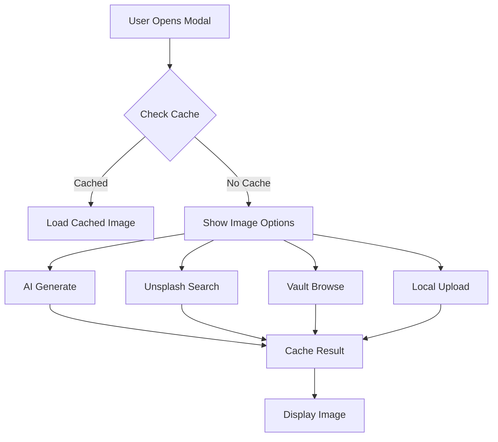

# WordPress Publisher UI Refactor Guide

## Overview

This document describes the major UI refactoring completed in v1.3.0, transitioning from the legacy modal to a modern, tab-based interface with AI-powered features.

## What's New

### 🎨 Modern Tab-Based Interface

The new modal features a clean, organized layout with three main tabs:

1. **Settings Tab** - Core publishing configuration
2. **Preview Tab** - Live content preview with editing capabilities
3. **AI Assistant Tab** - AI-powered content generation

### 🤖 AI-Powered Features

#### Featured Image Generation
- **AI Generation**: Generate images using AI based on your content
- **Unsplash Integration**: Search and select from millions of free photos
- **Vault Images**: Choose from images in your Obsidian vault
- **Smart Caching**: Previously generated images are cached for reuse

#### Content Enhancement
- **Auto Excerpt**: AI-generated summaries of your content
- **Smart Tags**: AI-suggested tags based on content analysis
- **Multi-language Support**: Works with both English and Chinese content

### 🎯 Enhanced User Experience

#### Visual Improvements
- **Ripple Effects**: Material Design-inspired button animations
- **Focus Enhancements**: Clear visual feedback for input fields
- **Hover States**: Smooth transitions and elevation effects
- **Loading States**: Skeleton screens and progress indicators

#### Interaction Improvements
- **Inline Editing**: Edit preview content directly
- **Tag Management**: Add, remove, and edit tags with visual feedback
- **Smooth Scrolling**: Animated scrolling to relevant sections
- **Tooltips**: Contextual help throughout the interface

### 📦 Image Management System

#### Intelligent Caching
- Caches generated images per note
- Tracks image source (AI, Unsplash, Vault)
- Automatic cache invalidation
- Reduces API calls and generation time

#### Multiple Image Sources
```typescript
type ImageSource = 'local' | 'unsplash' | 'ai' | 'vault' | 'cached' | 'auto';
```

- **local**: Uploaded from computer
- **unsplash**: Selected from Unsplash
- **ai**: Generated by AI
- **vault**: Chosen from Obsidian vault
- **cached**: Previously generated/selected
- **auto**: Automatically determined

## Migration from Legacy Modal

### For Users

The new modal is automatically enabled. Your existing settings and workflows remain compatible.

#### Key Differences

| Feature | Legacy Modal | New Modal V2 |
|---------|-------------|--------------|
| Layout | Single form | Tab-based interface |
| Featured Image | Manual upload only | AI/Unsplash/Vault/Upload |
| Excerpt | Manual entry | AI-generated + manual |
| Tags | Manual entry | AI-suggested + manual |
| Preview | None | Live preview with editing |
| Image Cache | None | Intelligent caching |

### For Developers

#### Architecture Changes

**Old Structure:**
```typescript
class WpPublishModal extends Modal {
  // Single monolithic modal
  // Limited state management
  // No tab system
}
```

**New Structure:**
```typescript
class WpPublishModalV2 extends AbstractModal {
  // Tab-based architecture
  // Comprehensive state management
  // Modular AI services
  // Image cache manager
  // Enhanced preview system
}
```

#### State Management

The new modal uses a centralized state management approach:

```typescript
private currentTab: 'settings' | 'preview' = 'settings';
private currentAITab: 'featured-image' | 'excerpt' | 'tags' = 'featured-image';
private imageSource: 'local' | 'unsplash' | 'ai' | 'vault' | 'cached' | 'auto';
private isEditingPreview: boolean = false;
```

#### Service Integration

```typescript
// AI Service for content generation
private aiService: AIService | null = null;

// Unsplash Service for image search
private unsplashService: UnsplashService | null = null;

// Image Cache Manager
private imageCacheManager: ImageCacheManager;
```

## Feature Details

### Tab System

#### Settings Tab
- Title and slug configuration
- Status and visibility settings
- Category and tag management
- Featured image selection
- Excerpt and custom fields

#### Preview Tab
- Live HTML preview
- Inline content editing
- Tag editing with visual feedback
- Responsive layout

#### AI Assistant Tab
- Featured image generation
- Excerpt generation
- Tag suggestions
- Progress indicators
- Error handling

### Image Generation Workflow



### AI Content Generation

#### Excerpt Generation
1. User clicks "Generate Excerpt"
2. System analyzes content
3. AI generates summary
4. Result displayed with edit option
5. Cached for future use

#### Tag Suggestions
1. User clicks "Generate Tags"
2. System analyzes content and existing tags
3. AI suggests relevant tags
4. User can accept, edit, or reject
5. Tags added to post

### Caching Strategy

#### Cache Structure
```typescript
interface ImageCacheEntry {
  url: string;
  source: ImageSource;
  timestamp: number;
  mediaId?: number;
  unsplashData?: UnsplashPhoto;
}
```

#### Cache Lifecycle
- **Creation**: When image is generated/selected
- **Retrieval**: On modal open for same note
- **Invalidation**: Manual clear or 30-day expiry
- **Storage**: Plugin data directory

## Customization

### Prompt Templates

Customize AI generation prompts in settings:

```typescript
// Image Generation Prompt
imageGenerationPrompt: string;

// Summary Generation Prompt
summaryPrompt: string;

// Tag Generation Prompt
tagsPrompt: string;
```

### Styling

The modal uses CSS custom properties for theming:

```css
.wp-publish-modal-v2 {
  --primary-color: #5b9dd9;
  --success-color: #46b450;
  --error-color: #dc3232;
  --border-radius: 8px;
  --transition-speed: 0.2s;
}
```

## Performance Considerations

### Optimizations
- Lazy loading of AI services
- Image caching reduces API calls
- Debounced input handlers
- Efficient DOM updates
- Skeleton screens for loading states

### Best Practices
- Generate images once, reuse via cache
- Use appropriate image sources (Unsplash for photos, AI for concepts)
- Clear cache periodically to free space
- Monitor API usage in settings

## Troubleshooting

### Common Issues

#### AI Features Not Working
- Check API key configuration in settings
- Verify network connectivity
- Check console for error messages

#### Images Not Caching
- Ensure plugin data directory is writable
- Check available disk space
- Verify cache settings

#### Preview Not Updating
- Try toggling edit mode
- Refresh the modal
- Check for JavaScript errors

### Debug Mode

Enable debug logging in settings:
```typescript
debugMode: true
```

This will log detailed information to the console.

## API Reference

### Key Methods

#### Modal Lifecycle
```typescript
onOpen(): void
onClose(): void
```

#### Tab Management
```typescript
private switchTab(tab: 'settings' | 'preview'): void
private switchAITab(tab: 'featured-image' | 'excerpt' | 'tags'): void
```

#### Image Management
```typescript
private handleImageGeneration(): Promise<void>
private handleUnsplashSearch(): Promise<void>
private handleVaultImageSelection(): Promise<void>
```

#### Content Generation
```typescript
private generateExcerpt(): Promise<void>
private generateTags(): Promise<void>
```

#### Preview System
```typescript
private renderPreviewTab(): void
private togglePreviewEdit(): void
private savePreviewChanges(): void
```

## Future Enhancements

### Planned Features
- [ ] Batch publishing support
- [ ] Template system for posts
- [ ] Advanced image editing
- [ ] SEO analysis and suggestions
- [ ] Social media preview
- [ ] Scheduled publishing
- [ ] Multi-site support

### Community Contributions

We welcome contributions! Areas of interest:
- Additional AI providers
- More image sources
- Enhanced preview features
- Accessibility improvements
- Performance optimizations

## Changelog

### v1.3.0 (Current)
- ✅ Complete UI refactor with tab system
- ✅ AI-powered featured image generation
- ✅ Unsplash integration
- ✅ Vault image browser
- ✅ Intelligent image caching
- ✅ AI excerpt generation
- ✅ AI tag suggestions
- ✅ Live preview with editing
- ✅ Visual enhancements and micro-interactions

### v1.2.x (Legacy)
- Basic publishing functionality
- Manual image upload
- Simple form interface

## Resources

- [Plugin Documentation](../README.md)
- [API Documentation](./API.md)
- [Contributing Guide](../CONTRIBUTING.md)
- [Issue Tracker](https://github.com/uu0/obsidian-wordpresspublisher/issues)

## Support

For questions or issues:
1. Check this guide and documentation
2. Search existing issues
3. Create a new issue with details
4. Join community discussions

---

**Last Updated**: 2026-03-14
**Version**: 1.3.0
**Author**: WordPress Publisher Team
